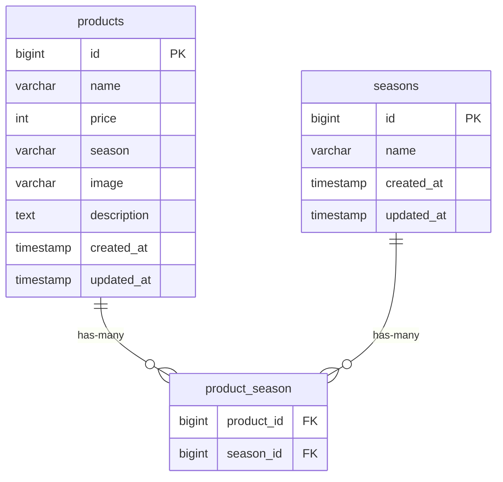

# mogitate

旬（季節）と商品を多対多で管理する Laravel アプリ。

## 環境構築

> リポジトリ直下に `docker-compose.yml`、Laravel 本体は `src/` 配下を想定しています。
> 以降、**Docker 方式**と**Docker なし（ローカル）方式**の両方を記載します。

### 1 取得
```bash
git clone https://github.com/hayama1225/mogitate.git
cd mogitate

# 1) 起動
docker compose up -d --build

# 2) 依存インストール（コンテナ内に composer が入っている想定）
docker compose exec php composer install

# 3) .env を用意（例からコピー）
docker compose exec php cp /var/www/.env.example /var/www/.env

# 4) アプリキー生成
docker compose exec php php /var/www/artisan key:generate

# 5) マイグレーション & シーディング
docker compose exec php php /var/www/artisan migrate --seed

# 6) ストレージ公開リンク
docker compose exec php php /var/www/artisan storage:link

# 7) （フロント資産がある場合はホストで）
cd src
npm install
npm run build   # or npm run dev
```
「ローカルの場合は DB_HOST=127.0.0.1, DB_USERNAME=root, DB_PASSWORD= に変更してください」

## 画像保存と表示（storage:link を利用：応用機能）
本アプリでは、画像は storage/app/public に保存し、
php artisan storage:link により public/storage → storage/app/public へシンボリックリンクを作成して参照します。

実体: src/storage/app/public/imgs/*.png（または .jpg）
リンク: src/public/storage/imgs/*.png
公開URL: http://localhost/storage/imgs/xxx.png

## 動作確認
# 実体（storage/app/public に存在するか）
ls src/storage/app/public/imgs
# シンボリックリンクが public にあるか（コンテナ内で確認）
docker compose exec php ls -l /var/www/public | grep storage
# リンク経由で参照できるか（コンテナ内で確認）
docker compose exec php ls /var/www/public/storage/imgs
# ブラウザでのアクセス例
http://localhost/storage/imgs/melon.png
```

```
## 使用技術（実行環境）

PHP 8.1.33 / Laravel 8.83.29

MySQL 8.x

Docker / Docker Compose v2（任意）

Composer 2.8.10

## ER図（Mermaid）


## URL
アプリ（nginx 経由）: http://localhost/
phpMyAdmin: http://localhost:8080

Server: mysql
Username: laravel_user
Password: laravel_pass
